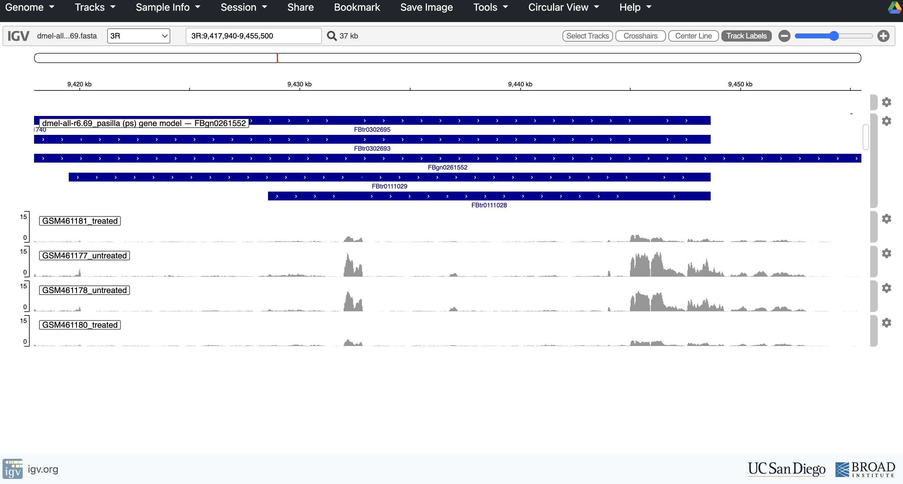

# Phase 1 Notes — Toy Pipeline (Drosophila / pasilla dataset)

Use this as a running lab notebook. Dated entries, screenshots of key plots,
and anything that broke + how it got fixed. This becomes the bulk of the
GitHub writeup for this phase.

## Setup

- Date started: 2026-09-10
- Conda env creation notes (any osx-arm64/Rosetta issues hit): Hit a Terms of Service prompt for the default Anaconda channels — fixed with `conda tos accept --override-channels --channel https://repo.anaconda.com/pkgs/main` (and same for `pkgs/r`). Otherwise both `rna-seq` and `deseq2` environments built cleanly using `CONDA_SUBDIR=osx-64` to get Intel/Rosetta builds of STAR and Salmon.

## Dataset

- Samples used: GSM461177, GSM461178 (untreated); GSM461180, GSM461181 (treated) — pasilla dataset, GEO GSE18508
- Source / download method: Downloaded via SRA using `prefetch` + `fasterq-dump`. Resolved each GSM → SRX → SRR accession manually via the GEO web pages, since some GSM/SRX experiments split into 2 SRR runs (lanes) that needed concatenating into one fastq pair per sample afterward.

## Pipeline run log

### 1. Pre-alignment QC

an FastQC on all 8 raw fastq.gz files (4 samples × R1/R2), then combined into one summary with MultiQC.

**Command:** `./scripts/01_fastqc.sh data/raw_fastq docs/qc_output`

**Key findings:**
- Adapter content: all 8 samples under 0.1% contamination — very clean data
- Overrepresented sequences: all 8 samples under 1% — no contamination artifacts
- Per-base sequence quality: consistent with expectations for Illumina Genome Analyzer II data (older platform, shorter 37bp reads)
- No red flags severe enough to warrant anything beyond standard trimming

Full report: [`docs/qc_output/multiqc_report.html`](qc_output/multiqc_report.html)

### 2. Trimming

Used fastp with default quality filtering and `--detect_adapter_for_pe` (paired-end auto adapter detection), minimum length 25bp.

| Sample | Condition | Reads passed filter | % passed | Duplication rate |
|---|---|---|---|---|
| GSM461177 | Untreated | 20,768,436 | ~98.2% | 13.2% |
| GSM461178 | Untreated | 20,875,258 | ~85.3% | 8.8% |
| GSM461180 | Treated | 21,057,766 | ~85.9% | 4.8% |
| GSM461181 | Treated | 24,678,922 | ~98.3% | 14.0% |

**Observation:** GSM461177 and GSM461181 showed high Read2 quality pre-trimming (Q20 ~92-95%), while GSM461178 and GSM461180 showed noticeably degraded Read2 quality (Q20 ~77%), leading to a much higher proportion of reads failing the quality filter (~28% vs ~2-3%). This split does **not** correlate with treatment condition (178 is untreated, 180 is treated), suggesting a batch, lane, or flow-cell effect rather than a biological one. fastp's filtering handled this cleanly — all samples still retained the large majority of reads. Worth keeping in mind during downstream QC (post-alignment mapping rates) to see if this pattern persists.

### Genome download

Initially attempted Ensembl release-116 (BDGP6.54) — URLs returned 404s across multiple naming patterns, including the `current_gtf` stable symlink path. Investigation revealed Ensembl underwent a major FTP restructuring in June 2026, retiring the old species-name-based FTP structure in favor of a new GCA/GCF-based structure at ftp.ebi.ac.uk.

Switched to **FlyBase** instead (the primary source for Drosophila annotations) — much simpler and more stable. Used release **r6.69**:
- Genome: `dmel-all-chromosome-r6.69.fasta.gz` (~146Mb uncompressed)
- Annotation: `dmel-all-r6.69.gtf.gz` (~79Mb uncompressed)

**Follow-up check:** also verified Ensembl's new GCA-based mirror (`ftp.ebi.ac.uk/pub/ensemblorganisms/GCA/000/001/215/4/flybase/2022_07/`) — it does host a genome + GTF for this assembly, with files dated as recently as April/May 2026, so it's an actively maintained mirror, not abandoned. However, the `2022_07` folder label reflects when Ensembl started tracking this particular annotation lineage, not necessarily which exact FlyBase release number the current file content corresponds to — there's no easy way to confirm it matches r6.69 specifically without downloading and inspecting the GTF header. Since we already had a confirmed, version-matched genome+GTF pair directly from FlyBase (the authoritative source), we stuck with that rather than switch.

Lesson: always verify genome/GTF download URLs before scripting a pipeline around them, and when using mirrors, be aware that folder/version labels don't always guarantee content currency — going to the primary source eliminates that ambiguity entirely.

### 3. STAR indexing + alignment

**Problem:** Every STAR alignment attempt (both x86_64/Rosetta and native
arm64 builds of STAR 2.7.11b) completed with a "finished successfully"
status and no error output, but `Log.final.out` reported
`Number of input reads: 0` — even against known-good, previously-indexed
genome data and valid trimmed FASTQ files.

**Ruled out systematically, one variable at a time:**
- Architecture (x86_64 Rosetta vs. native arm64) — both failed identically
- Genome index version/build — rebuilt from scratch, same result
- File location / iCloud Drive sync interference
- File format (verified FASTQ integrity, tried compressed and uncompressed)
- GTF annotation processing
- Memory pressure / OOM kill — confirmed via `echo $?` returning 0
  (clean exit, not a signal-9 kill) and `vm_stat` showing healthy free
  memory at time of run

**Root cause found:** Installed STAR 2.7.10b under `CONDA_SUBDIR=osx-64`
(Rosetta) as a controlled comparison against the same input file, same
index, same command structure. Result:
- STAR 2.7.11b → `Number of input reads: 0`
- STAR 2.7.10b → `Number of input reads: 1` (correct)

This isolated the bug to the STAR 2.7.11b bioconda build specifically.

**Fix:** Pinned `star=2.7.10b` in `environment.yml`, rebuilt the genome
index (FlyBase r6.69, `--sjdbOverhang 35` matching confirmed 36bp trimmed
read length across all four samples, `--genomeSAindexNbases 11`) under
the 2.7.10b environment.

**Second bug found during the real 4-sample run:** the local copy of
`04_star_align.sh` had drifted from the GitHub version — missing
`--readFilesCommand zcat`, `--quantTranscriptomeBan Singleend`, and
`--quantMode TranscriptomeSAM`. Without the read-files-command flag, STAR
tried to parse gzipped FASTQ as raw text and failed outright.

**Third gotcha:** switching in `zcat` on macOS still failed — Apple's
built-in `zcat` doesn't handle `.gz` the way GNU zcat does, throwing a
"can't stat ...gz.Z" error. Switched to `--readFilesCommand "gzip -dc"`,
which is portable across GNU/BSD/macOS gzip implementations.

**Result — real 4-sample alignment (all under STAR 2.7.10b, ~6-8 min/sample):**

| Sample | Input reads | Uniquely mapped % | Multi-mapped % | Splices |
|---|---|---|---|---|
| GSM461177 | 10,384,218 | 82.54% | 7.72% | 1,026,084 |
| GSM461178 | 10,437,629 | 82.68% | 6.49% | 1,080,477 |
| GSM461180 | 10,528,883 | 79.62% | 6.72% | 986,897 |
| GSM461181 | 12,339,461 | 84.97% | 6.35% | 1,317,752 |

All four samples show healthy alignment stats (80%+ uniquely mapped,
6-8% multi-mapped — normal ranges for RNA-seq). Interesting note: despite
177/181 showing much higher Read2 quality after trimming (~98% Q20-passing)
vs. 178/180 (~77-85%), all four landed in a similar uniquely-mapped range —
suggests the trimming step successfully normalized quality differences
before alignment.

**Lesson learned:** A tool reporting a clean success status is not proof
the tool worked correctly — version-specific silent bugs in bioinformatics
packages are a real failure mode. Systematic single-variable testing
(architecture → index → files → GTF → memory → version) is what actually
isolates them. Also: local script copies can silently drift from the
committed repo version — always diff against GitHub when a script behaves
unexpectedly, and platform-specific tool behavior (macOS zcat vs GNU zcat)
is a real, non-obvious source of bugs worth documenting for future-you.

**Open question / honest caveat:** The original full-pipeline runs that
first surfaced the "0 input reads" failure used real gzipped FASTQs with
`--readFilesCommand zcat`. Since macOS's built-in `zcat` doesn't handle
`.gz` correctly, it's unclear whether that alone could have contributed to
those early silent failures, or whether the 2.7.11b bug alone fully
explains them — a broken `zcat` pipe would normally be expected to crash
loudly (as it later did on 2.7.10b before switching to `gzip -dc`), not
exit cleanly with 0 reads, so the exact interaction isn't fully resolved.
This doesn't undermine the root-cause finding: the controlled comparison
test that isolated the 2.7.11b bug used an uncompressed file with no
`--readFilesCommand` at all, so it stands independently of this open
question. Flagging it here in the interest of accurate documentation
rather than overstating certainty.

### 4. Post-alignment QC

Ran `05_post_align_qc.sh` on all four samples: sorted/indexed BAMs,
`samtools flagstat`, and qualimap `bamqc` + `rnaseq` modules.

**Percent reads mapped to exons (qualimap rnaseq):**

| Sample | % mapped to exons |
|---|---|
| GSM461177 | 96.48% |
| GSM461178 | 97.03% |
| GSM461180 | 96.72% |
| GSM461181 | 97.31% |

Consistently high exonic mapping (96-97%) across all four samples — a good
sign of clean poly-A-selected/enriched RNA-seq library with minimal
genomic DNA contamination or intronic noise.

**samtools flagstat summary:**

| Sample | Primary reads | Properly paired | Singletons |
|---|---|---|---|
| GSM461177 | 18,745,568 | 100% | 0 |
| GSM461178 | 18,614,370 | 100% | 0 |
| GSM461180 | 18,181,054 | 100% | 0 |
| GSM461181 | 22,537,848 | 100% | 0 |

Note: flagstat's "100% mapped" reflects that STAR's default BAM output
only includes successfully mapped reads (unmapped reads are excluded
unless `--outSAMunmapped Within` is set) — it is not the true overall
mapping rate. The honest figure is the uniquely-mapped % from
`Log.final.out` in the alignment step (79.6-85.0% across samples).

**Qualimap warnings:** each report flagged a long list of read-mapped
chromosomes/scaffolds "not found in annotations." This is expected —
FlyBase's genome FASTA includes many small unplaced/unmapped scaffolds
present in the sequence but absent from the GTF gene models. Harmless,
does not affect exonic mapping stats.

### Bonus: Visual confirmation of pasilla knockdown (IGV)

Generated bigWig coverage tracks (`06_bigwig.sh`, BPM-normalized) for all
four samples and loaded them into IGV Web (igv.org/app) alongside the
FlyBase r6.69 GTF, navigated to the pasilla (ps) locus itself
(FBgn0261552, 3R:9,417,940-9,455,500). All four tracks were set to a
shared data range (0-15) for direct visual comparability, and renamed
per sample condition (untreated/treated) per GEO metadata for GSE18508.

Result: both untreated/control samples (GSM461177, GSM461178) show
clearly higher pasilla coverage than both treated/RNAi-knockdown samples
(GSM461180, GSM461181) — a clean visual confirmation that the RNAi
knockdown worked as expected, ahead of formal differential expression
testing.

Note: this is a qualitative sanity check, not a statistical result — the
actual fold-change and significance for pasilla (and every other gene)
will come from Salmon quantification + DESeq2 in later steps.

### 5. Salmon quantification

-

### 6. DESeq2 differential expression

- Coefficient tested:
- Number of significant genes (padj<0.05):
- Number of significant genes (padj<0.05, |log2FC|>2):
- Key plots: (embed pca_plot.png, volcano_plot.png, ma_plot.png here)

## What surprised me / what I'd do differently

-

## Comparison prep for Phase 2

- Runtime for each stage (for later comparison against HPCC):
